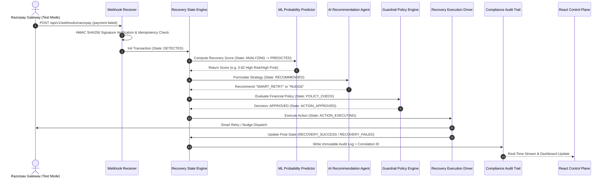

# RecoverX — Autonomous AI Revenue Recovery Control Plane

> **Razorpay Buildathon 2026 Submission** | Track 03 — AI Revenue Recovery  
> *"Don't just detect lost revenue. Recover it."*

[](https://github.com/Immanuelj15/RecoverX)
[](LICENSE)
[](https://razorpay.com)

---

## 📌 Data Honesty Notice
**All development and evaluation datasets used in this repository are 100% synthetic (`recoverx_revenue_recovery_dataset_10000.csv`). Razorpay Test Mode APIs and signature algorithms are implemented for realistic workflow demonstrations. No production payment data or real customer information is used.**

---

## 🚀 Executive Summary & Problem Statement

In subscription commerce and digital transactions, payment failures (due to expired cards, insufficient funds, network glitches, or bank downtime) result in catastrophic involuntary churn. Traditional systems rely on crude, fixed schedule retries that annoy customers or fail silently.

**RecoverX** bridges this gap by serving as an autonomous, multi-agent revenue recovery control plane:
1. **Real-Time Webhook Ingestion**: Receives failed payment events instantly with HMAC-SHA256 signature verification and distributed idempotency locking.
2. **State Machine Orchestration**: Manages strict state transitions (`DETECTED` → `ANALYZING` → `PREDICTED` → `RECOMMENDED` → `POLICY_CHECK` → `ACTION_APPROVED` → `ACTION_EXECUTING` → `RECOVERY_SUCCESS` / `RECOVERY_FAILED`).
3. **ML Recovery Scoring**: Predicts the statistical likelihood of success for each transaction based on customer LTV, retry history, failure reasons, and payment methods.
4. **LLM Context Agent**: Generates tailored recovery strategies (`SMART_RETRY`, `DELAYED_RETRY`, `PAYMENT_RECOVERY_NUDGE`, `HUMAN_ESCALATION`, `STOP`).
5. **Deterministic Guardrail Engine**: Enforces strict financial limits (`max_retry_count`, `high_value_threshold_inr`, unrecoverable failure filters).
6. **Immutable Audit Compliance**: Records full event timelines and JSON diff payloads for complete regulatory visibility.

---

## 🏗 System Architecture & Workflow Diagram



---

## ⚡ Recovery Action Matrix

| Recovery Action | Trigger Condition | Execution Mechanism | Target Outcome |
| :--- | :--- | :--- | :--- |
| **`SMART_RETRY`** | High ML probability ($>0.70$), temporary failure reason (`network_error`, `bank_timeout`). | Triggers immediate automated payment retry via Razorpay Test Mode integration. | Instant revenue recovery without customer friction. |
| **`DELAYED_RETRY`** | Medium ML probability ($0.40 - 0.70$), salary cycle alignment (`insufficient_balance`). | Schedules future retry attempt (`next_retry_scheduled_at`) aligned with optimal success window. | Maximize recovery rate while preventing bank overload. |
| **`PAYMENT_RECOVERY_NUDGE`** | Low ML probability ($<0.40$), user authentication required (`otp_timeout`). | Generates unique Payment Recovery Link (`https://recoverx.razorpay.com/pay/...`) and dispatches notification. | Empowers customer to complete payment manually. |
| **`HUMAN_ESCALATION`** | High value transaction ($\ge ₹50,000$). | Escalates transaction state to `ESCALATED` for human operator approval via Control Plane. | Risk mitigation on high-value enterprise accounts. |
| **`STOP`** | Max retries reached ($\ge 3$), or unrecoverable error (`card_expired`, `invalid_account`). | Terminates automated interventions, setting state to `STOPPED`. | Protects merchant reputation and avoids gateway penalties. |

---

## 🛠 Technology Stack

### **Backend Core (`backend/`)**
* **Runtime**: Node.js v22+
* **Framework**: Express.js
* **Database**: MongoDB + Mongoose ODM (Schemas, Compound Indexes, Validation)
* **Security & Performance**: Helmet, Express-Rate-Limit, NoSQL Injection Sanitization, CORS

### **ML & AI Engine (`ml_service/`)**
* **Framework**: Python 3.11, Scikit-Learn, FastAPI
* **Predictive Pipeline**: Random Forest Classifier (`model.joblib`) trained on 10,000 transaction samples
* **LLM Engine**: OpenAI API Provider Abstraction with deterministic heuristic fallback

### **Frontend Control Plane (`frontend/`)**
* **Framework**: React 18 + Vite
* **Styling**: Modern Glassmorphism CSS, Tailwind CSS
* **Visualizations**: Recharts (Payment Failure Reasons & Method Breakdown)
* **Icons & UI**: Lucide React, JetBrains Mono & Inter typography

---

## 🚦 Roadmap & Implementation Status

- [x] **Phase 1:** Project + Git + MongoDB Foundation Setup (`feat(db): setup MongoDB foundation`)
- [x] **Phase 2:** Mongoose Schemas (`feat(db): add Mongoose schemas`)
- [x] **Phase 3:** Validation + Compound Indexes (`feat(db): add validation and indexes`)
- [x] **Phase 4:** Seed Data + 10K CSV Importer Pipeline (`feat(db): add seed and CSV import`)
- [x] **Phase 5:** Repositories + Database Services Layer (`feat(db): add repositories`)
- [x] **Phase 6:** Recovery State Machine Engine (`feat(recovery): add recovery state machine`)
- [x] **Phase 7:** End-to-End Recovery Transaction Workflow Orchestrator (`feat(recovery): add transaction workflows`)
- [x] **Phase 8:** Compliance Audit Logging + Webhook Idempotency Layer (`feat(audit): add audit logging`)
- [x] **Phase 9:** Real-Time Analytics Aggregation Pipelines (`feat(analytics): add recovery metrics`)
- [x] **Phase 10:** Database Layer Integration Test Suite (10/10 Test Suites Passing)
- [x] **Phase 11:** Recovery Probability ML Model (`feat(ml): add recovery prediction pipeline`)
- [x] **Phase 12:** AI Recovery Recommendation Agent (`feat(agent): add AI recommendation agent`)
- [x] **Phase 13:** Policy / Guardrail Engine (`feat(policy): add policy engine`)
- [x] **Phase 14:** Razorpay Test Mode Integration & Webhooks (`feat(razorpay): add webhooks and test integration`)
- [x] **Phase 15:** Recovery Execution Workflow Engine (`feat(recovery): add recovery execution workflow`)
- [x] **Phase 16:** Backend REST API Router (`feat(api): add backend REST API endpoints`)
- [x] **Phase 17:** Frontend Recovery Dashboard (`feat(frontend): add React Vite dashboard UI`)
- [x] **Phase 18:** Audit Timeline UI & Compliance Inspection View (`feat(frontend): add audit timeline UI`)
- [x] **Phase 19:** End-to-End System Integration Test Suite (`test(e2e): add end-to-end integration test suite`)
- [x] **Phase 20:** Performance & Security Hardening (`feat(security): add rate limiting, helmet, and input sanitization`)
- [x] **Phase 21:** Final Architecture & User Documentation (`docs(readme): add comprehensive architecture and user guide`)
- [x] **Phase 22:** Hackathon Demo Preparation & Production Release Tag (`v1.0.0`)

---

## 💻 Quickstart & Local Installation Guide

### **Prerequisites**
- Node.js (v18.0+)
- MongoDB (running locally on port 27017 or a MongoDB Atlas URI)
- Git

### **1. Clone & Install Dependencies**
```bash
git clone https://github.com/Immanuelj15/RecoverX.git
cd RecoverX

# Install Backend Dependencies
cd backend
npm install

# Install Frontend Dependencies
cd ../frontend
npm install
```

### **2. Environment Configuration**
Create a `.env` file inside `backend/`:
```env
PORT=5000
NODE_ENV=development
MONGODB_URI=mongodb://localhost:27017/recoverx
RAZORPAY_WEBHOOK_SECRET=recoverx_secret_key_2026
OPENAI_API_KEY=your_optional_openai_key
```

### **3. Seed Synthetic Dataset (10,000 Transactions)**
```bash
cd backend
npm run seed
```
*Output*: Successfully populates `Transaction` and `PolicyConfig` collections with 10,000 records from `data/raw/recoverx_revenue_recovery_dataset_10000.csv`.

### **4. Run Automated Test Suite (16 Test Suites, 68 Tests)**
```bash
cd backend
npm test
```

### **5. Launch Backend & Frontend Servers**
```bash
# Terminal 1: Backend Server (Port 5000)
cd backend
npm run dev

# Terminal 2: Frontend Vite App (Port 5173)
cd frontend
npm run dev
```

Open your browser at `http://localhost:5173` to access the RecoverX Control Plane!

---

## 📡 REST API Reference

| Method | Endpoint | Description |
| :--- | :--- | :--- |
| `POST` | `/api/v1/webhooks/razorpay` | Receives Razorpay `payment.failed` webhooks with signature verification |
| `GET` | `/api/v1/transactions` | Query paginated transactions with state, risk band, and search filters |
| `GET` | `/api/v1/transactions/:payment_id` | Fetch detailed transaction metadata and audit log history |
| `POST` | `/api/v1/transactions/:payment_id/trigger-recovery` | Manually trigger AI recovery workflow for a payment |
| `GET` | `/api/v1/analytics/summary` | Fetch executive KPI summary (Revenue at Risk, Recovered, Rate %) |
| `GET` | `/api/v1/analytics/charts` | Fetch failure reason and payment method breakdown chart data |
| `GET` | `/api/v1/policies` | Fetch active global guardrail policy configuration |
| `PUT` | `/api/v1/policies` | Update policy guardrails (`max_retry_count`, `high_value_threshold_inr`, etc.) |
| `GET` | `/api/v1/audit-logs` | Fetch paginated compliance audit logs with event type filter |
| `GET` | `/health` | System health check and database connection state |

---

## 🛡️ License & Acknowledgments
Designed & developed for the **Razorpay Buildathon 2026**. Licensed under the [MIT License](LICENSE).
