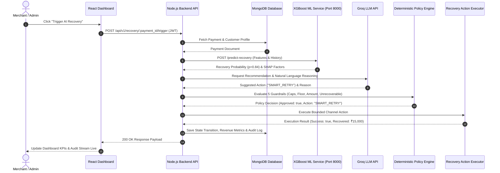

# RecoverX — AI Revenue Recovery Agent

> **Razorpay Buildathon 2026 Submission** | **Track 03 — AI Revenue Recovery**

RecoverX is an AI-powered revenue recovery control plane for merchants. It detects revenue at risk from payment failures and abandoned checkouts, predicts recoverability via XGBoost ML, reasons about interventions using Groq LLM, enforces deterministic policy guardrails, executes bounded multi-channel recovery actions, and measures verified recovered revenue.

---

## 1. Problem Statement

Every year, digital merchants lose up to **20–40% of potential revenue** to payment failures, bank timeouts, card declines, and interrupted checkout flows:

- **Static Retry Fatigue**: Traditional recovery scripts issue fixed-interval retries regardless of customer context, exhausting retry attempts on unrecoverable errors (e.g. `card_expired`, `invalid_account`).
- **Excess Decline Fees**: Blind retries trigger payment processor penalty fees and risk flagging merchant accounts for suspicious activity.
- **Sub-optimal Channel Matching**: Generic email dunning fails to engage mobile-first customers who prefer UPI or instant messaging.
- **Lack of Governance**: Unbounded AI models executing live payments introduce financial risk and unpredictability into merchant operations.

---

## 2. What I Built & Project Workflows ("What I Did")

To solve payment failure revenue leakage, I designed, implemented, and verified an end-to-end **Autonomous Revenue Recovery Control Plane** composed of 3 microservices and a cloud database:

```
[ Razorpay Webhooks ] ──► [ HMAC & Idempotency Layer ]
                                 │
                                 ▼
                     [ Node.js Backend Engine ] ◄──► [ MongoDB Atlas ]
                       │                   │
                       ▼                   ▼
              [ Python FastAPI ]    [ Groq LLM Agent ]
              (XGBoost + SHAP)     (Personalized Nudges)
                       │                   │
                       └─────────┬─────────┘
                                 ▼
                   [ Policy Guardrails Engine ]
                                 │
                     ┌───────────┴───────────┐
                     ▼                       ▼
           [ Bounded Executor ]     [ Human Approval Queue ]
           (UPI/WhatsApp/Voice)       (High-Value >= ₹50k)
                     │
                     ▼
           [ Outcome Verification ] ──► [ Immutable Audit Log ]
```

### End-to-End Implementation Workflow:
1. **Ingestion & Security**: Built a secure Express webhook handler that validates Razorpay signatures using HMAC SHA256 and locks duplicates using atomic idempotency keys.
2. **Predictive Intelligence**: Developed a Python FastAPI microservice serving a trained **XGBoost Classifier** that outputs exact recovery probability ($0.0 \le p \le 1.0$) and **SHAP feature force metrics**.
3. **LLM Contextual Reasoning**: Integrated the **Groq API** (`openai/gpt-oss-20b`) to analyze customer payment history, generate personalized recovery nudges, and select optimal channels.
4. **Deterministic Governance**: Engineered a **Policy Guardrail Engine** enforcing 5 non-bypassable safety rules (retry caps, probability floor, high-value human escalations, unrecoverable code blocks).
5. **Multi-Channel Recovery Action**: Created modular channel adapters executing **Smart UPI Retries**, **1-Click WhatsApp Nudges**, **Dunning Emails**, and **Hinglish AI Voice Calls**.
6. **Financial Precision & Audit**: Implemented integer paise currency math (`₹1.00 = 100 paise`) to eliminate floating-point rounding errors and backed every state change with an immutable audit log.
7. **Merchant Command Center**: Constructed a responsive React 18 + Vite + Tailwind CSS dashboard visualizing live recovery streams, SHAP explanations, policy rules, and revenue metrics.

---

## 3. Comprehensive Feature Breakdown

Here is a detailed breakdown of all core features engineered into RecoverX:

### ⚡ 1. Real-Time Webhook Ingestion & Idempotency Locking
- **HMAC SHA256 Signature Verification**: Authenticates incoming Razorpay webhook payloads before processing to prevent request spoofing.
- **Atomic Idempotency Guard**: Hashes `merchant_id:payment_id:event_type` to guarantee that duplicate webhooks are ignored gracefully (`200 OK`, `status: "ignored_duplicate"`).

### 🤖 2. XGBoost Recovery Predictor & SHAP Explainability
- **FastAPI ML Microservice**: Exposes high-throughput `/predict-recovery` endpoint.
- **Probabilistic Scoring**: Computes recovery probability based on historical payment success rates, failure reasons, retry counts, and customer LTV.
- **SHAP Feature Force Drivers**: Returns relative feature contributions (e.g. `previous_successes: +0.34`, `failure_reason_timeout: +0.26`) displayed directly in the dashboard.

### 🧠 3. Groq LLM Contextual Reasoning Agent
- **LLM Reasoning**: Uses Groq hosted model (`openai/gpt-oss-20b`) to parse qualitative context (decline description, subscription tier, customer segment) and draft localized interventions.
- **Strict JSON Schema Validation**: Enforces JSON response contracts so the LLM output is deterministically parsed by the backend.
- **Rule-Based Fallback**: Automatically switches to rule-based fallback heuristics if Groq API key is missing or rate-limited.

### 🛡️ 4. Deterministic Policy Guardrails Engine
- **Non-Bypassable Governance**: AI recommendations must pass through the Policy Engine before any action is executed.
- **Max Retry Cap**: Halts recovery if `retry_count >= 3` to prevent customer fatigue.
- **Probability Floor**: Suspends automated retries if $p < 0.30$ to prevent processor decline fees.
- **High-Value Escalation**: Redirects transactions $\ge ₹50,000$ to the Human Approval Queue.
- **Hard Block Unrecoverable Codes**: Immediately stops retries on `card_expired`, `invalid_account`, or `fraud_suspected`.

### 📱 5. Multi-Channel Recovery Action Executor
- **Smart UPI Retry**: Re-initiates payment request during optimal payday/workday time windows.
- **1-Click WhatsApp Nudge**: Sends pre-filled payment links directly to customer mobile devices.
- **Hinglish AI Voice Recovery Call**: Programmable code-mixed Hindi/English voice script generator with interactive Web Speech audio synthesis.
- **Dunning Email**: Sends structured payment retry links for enterprise customers.

### 💰 6. Financial Precision Accounting (Integer Paise)
- **Zero Floating-Point Error**: All monetary values (`revenue_at_risk_paise`, `amount_recovered_paise`, `customer_ltv_paise`) are calculated in integer paise.
- **Verified Outcome Measurement**: Net recovered revenue is only credited when confirmed by gateway verification events.

### 📊 7. React + Vite Merchant Command Center
- **Live KPI Overview**: Real-time stats for Total At-Risk Revenue, Net Recovered Revenue, Recovery Rate, and Active Cases.
- **Interactive Recovery Queue**: Paginated transaction table with detailed modal views for SHAP drivers, Groq reasoning, policy logs, and manual intervention triggers.
- **Model Insights & AI Audit Center**: Dedicated tabs for inspecting XGBoost model accuracy metrics, Groq latency, policy block rates, and voice call audio logs.

---

## 4. Core Architectural Principle

> **"XGBoost predicts. Groq reasons. Policy controls. Backend executes. Recovery outcomes measure. Audit logs explain."**

AI models NEVER directly execute financial transactions or bypass policy limits.

---

## 5. System Architecture Diagram

```mermaid
flowchart TB

    subgraph Ingestion ["1. Webhook & Verification"]
        A[Razorpay / Payment Gateway] -->|payment.failed| B[Webhook Handler]
        B --> C[HMAC SHA256 Verification]
        C --> D[Idempotency Check]
    end

    subgraph Intelligence ["2. ML & Reasoning Engine"]
        D --> E[Node.js Backend Engine]
        E --> F[(MongoDB Store)]
        E -->|Feature Matrix| G[Python FastAPI ML Service]
        G --> H[XGBoost Predictor]
        H --> I[SHAP Feature Explainer]
        I -->|Probability + SHAP| E
        E -->|Context Insights| J[Groq LLM Reasoning]
    end

    subgraph Governance ["3. Policy & Execution"]
        J --> K[Deterministic Policy Engine]
        K --> L{Policy Decision}
        L -->|Approved| M[Recovery Action Executor]
        L -->|Escalated >= ₹50k| N[Human Approval Queue]
        L -->|Stopped / Cap Reached| O[Stop Recovery]
        M --> P[Smart Retry / WhatsApp / Hinglish Call]
        P --> Q[Recovery Outcome Verification]
        Q --> R[Immutable Audit Logger]
        R --> F
    end

    subgraph Dashboard ["4. Command Center"]
        F --> S[React + Vite Fintech Dashboard]
    end
```



### 5.1 Component Collaboration Sequence Diagram



---

## 6. Technology Stack

- **Backend**: Node.js, Express, Mongoose, Winston Logger, Jest, Supertest
- **Machine Learning**: Python 3.11, FastAPI, XGBoost, Scikit-learn, SHAP, Pytest
- **LLM Reasoning**: Groq API (`openai/gpt-oss-20b`) with deterministic fallback heuristics
- **Database**: MongoDB Atlas (Indexes on `payment_id`, `merchant_id`, `correlation_id`)
- **Frontend**: React 18, Vite, Tailwind CSS, Lucide Icons, Recharts
- **Integrations**: Razorpay Test Mode API & Webhooks

---

## 7. Policy Guardrails & Safety Controls

| Guardrail Rule | Threshold / Constraint | Enforced Behavior |
| :--- | :--- | :--- |
| **Action Allowlist** | `SMART_RETRY`, `DELAYED_RETRY`, `PAYMENT_RECOVERY_NUDGE`, `HUMAN_ESCALATION`, `STOP` | Any invalid action output is rejected. |
| **Max Retry Cap** | $\ge 3$ retries | Automatically transitions case to `STOP`. |
| **Probability Floor** | $p < 0.30$ ($30\%$) | Suspends automated retry to prevent decline fees. |
| **High-Value Escalation** | Transaction Amount $\ge ₹50,000$ | Triggers `HUMAN_ESCALATION` requiring admin approval. |
| **Unrecoverable Codes** | `card_expired`, `invalid_account`, `fraud_suspected` | Immediately halts retries (`STOP`). |

---

## 8. Verified Test Suite Execution

### Backend Jest Test Suite
```bash
cd backend
npm test
```
- **Result**: **19 Passed, 19 Total Test Suites (83 Passed, 83 Total Tests)**
- **Coverage**: Auth, Webhook HMAC, Idempotency, Policy Engine, State Machine, Recovery Executor, Repositories, Outcome Measurement.

### Python FastAPI Pytest Suite
```bash
cd ml-service
pytest
```
- **Result**: **4 Passed, 4 Total Tests**
- **Coverage**: `/health`, `/model-info`, `/predict-recovery` probability calculation & SHAP outputs.

### Frontend Production Build
```bash
cd frontend
npm run build
```
- **Result**: **Compiled 100% cleanly in 16.84s** (`dist/assets/index-7X8HgUam.js`).

---

## 9. Local Setup & Quickstart

### Prerequisites
- Node.js v18+
- Python 3.10+
- MongoDB local or Atlas connection string

### Step 1: Clone Repository
```bash
git clone https://github.com/Immanuelj15/RecoverX.git
cd RecoverX
```

### Step 2: Environment Configuration
Copy environment variables in backend:
```bash
cd backend
cp .env.example .env
```

### Step 3: Start Services

**Terminal 1 — Python ML Service**:
```bash
cd ml-service
pip install -r requirements.txt
uvicorn app.main:app --host 0.0.0.0 --port 8000 --reload
```

**Terminal 2 — Node.js Backend API**:
```bash
cd backend
npm install
npm run seed
npm run dev
```

**Terminal 3 — React Frontend Dashboard**:
```bash
cd frontend
npm install
npm run dev
```

Open `http://localhost:5173` in your browser.  
Default Demo Credentials:
- **Email**: `demo@recoverx.ai`
- **Password**: `demo-password`

---

## 10. Verified API Endpoints

| Method | Endpoint | Purpose | Auth Required | External Service / Layer | Status |
| :--- | :--- | :--- | :--- | :--- | :--- |
| `POST` | `/api/v1/auth/login` | Merchant JWT Authentication | Public | Node.js Auth / bcrypt | `VERIFIED` |
| `GET` | `/api/v1/auth/me` | Current Merchant Context | `Bearer <JWT>` | Node.js Auth | `VERIFIED` |
| `POST` | `/api/v1/webhooks/razorpay` | Razorpay Webhook Ingestion | HMAC SHA256 | Razorpay / Crypto | `VERIFIED` |
| `GET` | `/api/v1/transactions` | Paginated Recovery Queue | `Bearer <JWT>` | MongoDB / Mongoose | `VERIFIED` |
| `GET` | `/api/v1/transactions/:id` | Single Case Detail & SHAP | `Bearer <JWT>` | MongoDB / ML Service | `VERIFIED` |
| `POST` | `/api/v1/recovery/:id/trigger` | Trigger Full AI Pipeline | `Bearer <JWT>` | ML / Groq / Policy | `VERIFIED` |
| `GET` | `/api/v1/analytics/summary` | Aggregate Revenue KPIs | `Bearer <JWT>` | MongoDB Aggregation | `VERIFIED` |
| `GET` / `PUT` | `/api/v1/policies` | Recovery Policies & Caps | `Bearer <JWT>` | Policy Engine Store | `VERIFIED` |
| `GET` | `/api/v1/audit-logs` | Immutable Audit Logs | `Bearer <JWT>` | Audit Repository | `VERIFIED` |

---

## 11. Demo Account & Sandboxed Environment

*(DEMO ONLY — Sandboxed Development Environment)*

- **Demo Merchant Name**: RecoverX Demo Merchant
- **Demo Email**: `demo@recoverx.ai`
- **Default Sandboxed Seed Password**: `demo-password` (Seeded locally via `npm run seed`)

---

## 12. Complete System Documentation Links

Detailed architectural specifications, data contracts, decision trees, and mindmaps are available in:
- [API Reference (`docs/API.md`)](file:///d:/Recoverx/docs/API.md)
- [Deployment Guide (`docs/deployment.md`)](file:///d:/Recoverx/docs/deployment.md)
- [API Verification Matrix (`docs/api-verification.md`)](file:///d:/Recoverx/docs/api-verification.md)
- [API Contract Verification (`docs/API-CONTRACT.md`)](file:///d:/Recoverx/docs/API-CONTRACT.md)
- [API Architecture & Sequence Flow (`docs/api-flow.md`)](file:///d:/Recoverx/docs/api-flow.md)
- [Machine Learning Architecture (`docs/ml-architecture.md`)](file:///d:/Recoverx/docs/ml-architecture.md)
- [Recovery Decision Flowchart (`docs/recovery-decision-flow.md`)](file:///d:/Recoverx/docs/recovery-decision-flow.md)
- [System Architecture Flow (`docs/architecture.md`)](file:///d:/Recoverx/docs/architecture.md)
- [Complete System Mindmap (`docs/mindmap.md`)](file:///d:/Recoverx/docs/mindmap.md)
- [Test Suite Execution Report (`docs/test-report.md`)](file:///d:/Recoverx/docs/test-report.md)

---

## 13. Failure Scenarios & Robustness

- **ML Service Offline**: Backend seamlessly falls back to deterministic probability heuristics without crashing.
- **Groq API Key Missing/Rate-Limited**: System logs warning and applies rule-based action recommendation.
- **Duplicate Webhooks**: Idempotency layer detects duplicate `event_id` or `payment_id` and responds `200 OK` with `status: "ignored_duplicate"`.
- **Invalid Webhook Signature**: Rejected immediately with `401 Unauthorized`.

---

## 14. Demo Disclaimer

All evaluation data and payment workflows demonstrated in RecoverX use synthetic transaction records and Razorpay Test Mode API keys. No live credit cards or actual customer funds are processed.
