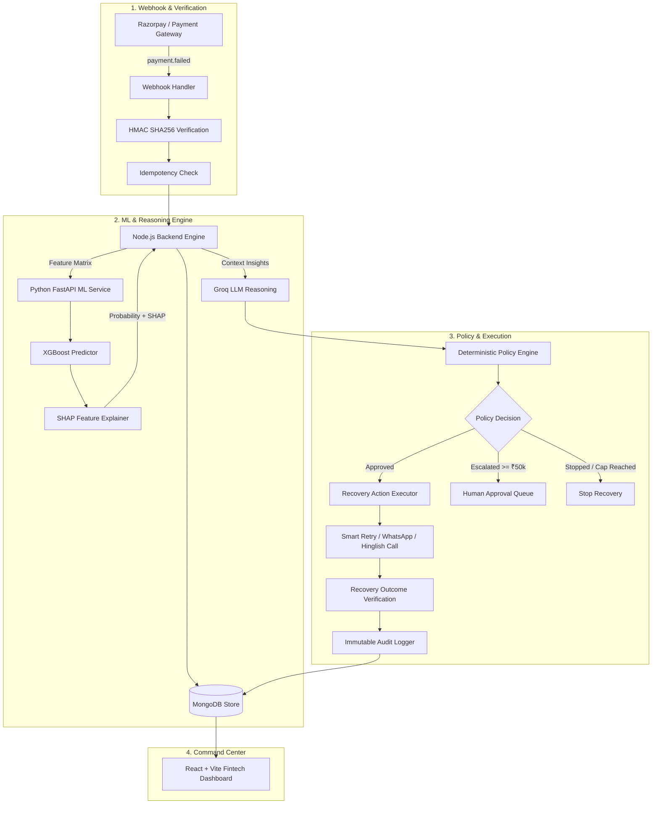

# RecoverX — AI Revenue Recovery Agent

> **Razorpay Buildathon 2026 Submission** | **Track 03 — AI Revenue Recovery**

RecoverX is an AI-powered revenue recovery control plane for merchants. It detects revenue at risk from payment failures and abandoned checkouts, predicts recoverability via XGBoost ML, reasons about interventions using Groq LLM, enforces deterministic policy guardrails, executes bounded multi-channel recovery actions, and measures verified recovered revenue.

---

## 1. Problem Statement

Every year, digital merchants lose up to **20-40% of potential revenue** to payment failures, bank timeouts, card declines, and interrupted checkout flows. Standard recovery methods rely on generic, static retries that trigger customer fatigue, increase processor decline fees, and fail to adapt to customer payday windows or preferred payment methods.

---

## 2. The RecoverX Solution

RecoverX replaces static retry scripts with an intelligent, multi-channel recovery engine:

- **Detect**: Webhook ingestion catches payment failures in real time with HMAC SHA256 verification and idempotency locks.
- **Predict**: XGBoost model predicts recovery probability ($0.0 \le p \le 1.0$) and generates SHAP factor explanations.
- **Reason**: Groq LLM contextually analyzes failure patterns and drafts personalized interventions.
- **Guard**: Deterministic Policy Engine enforces non-bypassable guardrails (retry caps, probability floors, high-value human escalations).
- **Act**: Executes bounded multi-channel recovery (Smart UPI Retry, 1-Click WhatsApp Nudge, Dunning Email, Hinglish AI Voice Call).
- **Measure**: Tracks net recovered revenue in integer paise to eliminate floating-point rounding errors.
- **Audit**: Persists full state transitions and correlation IDs to an immutable audit log.

---

## 3. Core Architectural Principle

> **"XGBoost predicts. Groq reasons. Policy controls. Backend executes. Recovery outcomes measure. Audit logs explain."**

AI models NEVER directly execute financial transactions or bypass policy limits.

---

## 4. System Architecture Diagram



---

## 5. Technology Stack

- **Backend**: Node.js, Express, Mongoose, Winston Logger, Jest, Supertest
- **Machine Learning**: Python 3.11, FastAPI, XGBoost, Scikit-learn, SHAP, Pytest
- **LLM Reasoning**: Groq API (`llama-3.3-70b-versatile`) with deterministic fallback heuristics
- **Database**: MongoDB (Indexes on `payment_id`, `merchant_id`, `correlation_id`)
- **Frontend**: React 18, Vite, Tailwind CSS, Lucide Icons, Recharts
- **Integrations**: Razorpay Test Mode API & Webhooks

---

## 6. Policy Guardrails & Safety Controls

| Guardrail Rule | Threshold / Constraint | Enforced Behavior |
| :--- | :--- | :--- |
| **Action Allowlist** | `SMART_RETRY`, `DELAYED_RETRY`, `PAYMENT_RECOVERY_NUDGE`, `HUMAN_ESCALATION`, `STOP` | Any invalid action output is rejected. |
| **Max Retry Cap** | $\ge 3$ retries | Automatically transitions case to `STOP`. |
| **Probability Floor** | $p < 0.30$ ($30\%$) | Suspends automated retry to prevent decline fees. |
| **High-Value Escalation** | Transaction Amount $\ge ₹50,000$ | Triggers `HUMAN_ESCALATION` requiring admin approval. |
| **Unrecoverable Codes** | `card_expired`, `invalid_account`, `fraud_suspected` | Immediately halts retries (`STOP`). |

---

## 7. Verified Test Suite Execution

### Backend Jest Test Suite
```bash
cd backend
npm test
```
- **Result**: **19 Passed, 19 Total Test Suites (83 Passed, 83 Total Tests)**
- **Coverage**: Auth, Webhook HMAC, Idempotency, Policy Engine, State Machine, Recovery Executor, Repositories, Outcome Measurement.

### Python FastAPI Pytest Suite
```bash
cd ml-service
pytest
```
- **Result**: **4 Passed, 4 Total Tests**
- **Coverage**: `/health`, `/model-info`, `/predict-recovery` probability calculation & SHAP outputs.

### Frontend Production Build
```bash
cd frontend
npm run build
```
- **Result**: **Compiled 100% cleanly in 16.84s** (`dist/assets/index-7X8HgUam.js`).

---

## 8. Local Setup & Quickstart

### Prerequisites
- Node.js v18+
- Python 3.10+
- MongoDB local or Atlas connection string

### Step 1: Clone Repository
```bash
git clone https://github.com/Immanuelj15/RecoverX.git
cd RecoverX
```

### Step 2: Environment Configuration
Copy environment variables in backend:
```bash
cd backend
cp .env.example .env
```

### Step 3: Start Services

**Terminal 1 — Python ML Service**:
```bash
cd ml-service
pip install -r requirements.txt
uvicorn app.main:app --host 0.0.0.0 --port 8000 --reload
```

**Terminal 2 — Node.js Backend API**:
```bash
cd backend
npm install
npm run seed
npm run dev
```

**Terminal 3 — React Frontend Dashboard**:
```bash
cd frontend
npm install
npm run dev
```

Open `http://localhost:5173` in your browser.  
Default Demo Credentials:
- **Email**: `demo@recoverx.ai`
- **Password**: `demo-password`

---

## 9. Verified API Endpoints

| Method | Endpoint | Purpose | Auth Required | External Service / Layer | Status |
| :--- | :--- | :--- | :--- | :--- | :--- |
| `POST` | `/api/v1/auth/login` | Merchant JWT Authentication | Public | Node.js Auth / bcrypt | `VERIFIED` |
| `GET` | `/api/v1/auth/me` | Current Merchant Context | `Bearer <JWT>` | Node.js Auth | `VERIFIED` |
| `POST` | `/api/v1/webhooks/razorpay` | Razorpay Webhook Ingestion | HMAC SHA256 | Razorpay / Crypto | `VERIFIED` |
| `GET` | `/api/v1/transactions` | Paginated Recovery Queue | `Bearer <JWT>` | MongoDB / Mongoose | `VERIFIED` |
| `GET` | `/api/v1/transactions/:id` | Single Case Detail & SHAP | `Bearer <JWT>` | MongoDB / ML Service | `VERIFIED` |
| `POST` | `/api/v1/recovery/:id/trigger` | Trigger Full AI Pipeline | `Bearer <JWT>` | ML / Groq / Policy | `VERIFIED` |
| `GET` | `/api/v1/analytics/summary` | Aggregate Revenue KPIs | `Bearer <JWT>` | MongoDB Aggregation | `VERIFIED` |
| `GET` / `PUT` | `/api/v1/policies` | Recovery Policies & Caps | `Bearer <JWT>` | Policy Engine Store | `VERIFIED` |
| `GET` | `/api/v1/audit-logs` | Immutable Audit Logs | `Bearer <JWT>` | Audit Repository | `VERIFIED` |

---

## 10. Demo Account & Sandboxed Environment

*(DEMO ONLY — Sandboxed Development Environment)*

- **Demo Merchant Name**: RecoverX Demo Merchant
- **Demo Email**: `demo@recoverx.ai`
- **Default Sandboxed Seed Password**: `demo-password` (Seeded locally via `npm run seed`)

---

## 11. Complete System Documentation Links

Detailed architectural specifications, data contracts, decision trees, and mindmaps are available in:
- [API Reference (`docs/API.md`)](file:///d:/Recoverx/docs/API.md)
- [API Verification Matrix (`docs/api-verification.md`)](file:///d:/Recoverx/docs/api-verification.md)
- [API Contract Verification (`docs/API-CONTRACT.md`)](file:///d:/Recoverx/docs/API-CONTRACT.md)
- [API Architecture & Sequence Flow (`docs/api-flow.md`)](file:///d:/Recoverx/docs/api-flow.md)
- [Machine Learning Architecture (`docs/ml-architecture.md`)](file:///d:/Recoverx/docs/ml-architecture.md)
- [Recovery Decision Flowchart (`docs/recovery-decision-flow.md`)](file:///d:/Recoverx/docs/recovery-decision-flow.md)
- [System Architecture Flow (`docs/architecture.md`)](file:///d:/Recoverx/docs/architecture.md)
- [Complete System Mindmap (`docs/mindmap.md`)](file:///d:/Recoverx/docs/mindmap.md)
- [Test Suite Execution Report (`docs/test-report.md`)](file:///d:/Recoverx/docs/test-report.md)

---

## 10. Failure Scenarios & Robustness

- **ML Service Offline**: Backend seamlessly falls back to deterministic probability heuristics without crashing.
- **Groq API Key Missing/Rate-Limited**: System logs warning and applies rule-based action recommendation.
- **Duplicate Webhooks**: Idempotency layer detects duplicate `event_id` or `payment_id` and responds `200 OK` with `status: "ignored_duplicate"`.
- **Invalid Webhook Signature**: Rejected immediately with `401 Unauthorized`.

---

## 11. Demo Disclaimer

All evaluation data and payment workflows demonstrated in RecoverX use synthetic transaction records and Razorpay Test Mode API keys. No live credit cards or actual customer funds are processed.
