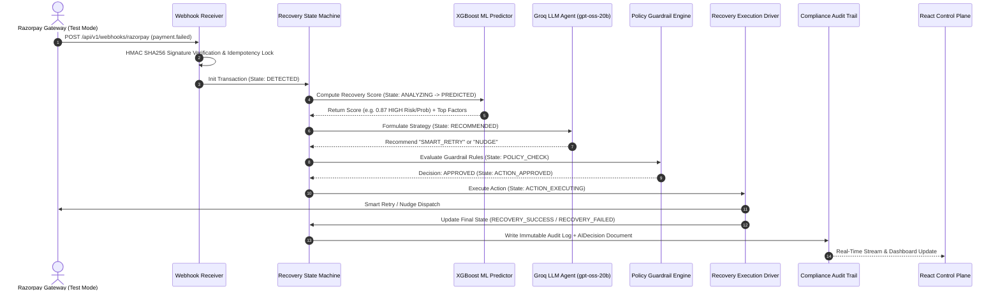

# RecoverX — Autonomous AI Revenue Recovery Control Plane

> **Razorpay Buildathon 2026 Submission** | Track 03 — AI Revenue Recovery  
> *"Don't just detect lost revenue. Recover it."*

[](https://github.com/Immanuelj15/RecoverX)
[](LICENSE)
[](https://razorpay.com)

---

## 📌 Data Honesty Notice
**All development and evaluation datasets used in this repository are 100% synthetic (`recoverx_revenue_recovery_dataset_10000.csv`). Razorpay Test Mode APIs and HMAC-SHA256 signature algorithms are implemented for realistic workflow demonstrations. No production payment data or real customer information is used.**

---

## 🚀 Executive Summary & Pitch

In subscription commerce and digital transactions, payment failures (due to expired cards, insufficient funds, network glitches, or bank downtime) result in catastrophic involuntary churn. Traditional systems rely on crude, fixed schedule retries that annoy customers or fail silently.

**RecoverX** bridges this gap by serving as an autonomous, multi-agent revenue recovery control plane:
1. **Real-Time Webhook Ingestion**: Receives failed payment events instantly with HMAC-SHA256 signature verification and atomic idempotency locking.
2. **State Machine Orchestration**: Manages strict state transitions (`DETECTED` → `ANALYZING` → `PREDICTED` → `RECOMMENDED` → `POLICY_CHECK` → `ACTION_APPROVED` → `ACTION_EXECUTING` → `RECOVERY_SUCCESS` / `RECOVERY_FAILED`).
3. **ML Recovery Scoring (Layer 1)**: Predicts statistical probability of recovery $P(\text{recovery}) \in [0.0, 1.0]$ based on customer LTV, retry history, failure reasons, and payment methods.
4. **Groq LLM Reasoning Agent (Layer 2)**: Generates context-aware recovery strategies using `openai/gpt-oss-20b` hosted on Groq API (`SMART_RETRY`, `DELAYED_RETRY`, `PAYMENT_RECOVERY_NUDGE`, `HUMAN_ESCALATION`, `STOP`).
5. **Deterministic Guardrail Engine**: Enforces strict financial rules (`MAX_RETRIES`, `HIGH_VALUE_TRANSACTION`, `UNRECOVERABLE_FAILURE`, `LOW_PROBABILITY_THRESHOLD`) with integer paise precision.
6. **Immutable Audit Compliance**: Records full event timelines, AI decisions, and JSON diff payloads in MongoDB for regulatory visibility.

---

## 🏗 System Architecture Diagram



---

## ⚡ Recovery Action Matrix

| Recovery Action | Trigger Condition | Execution Mechanism | Target Outcome |
| :--- | :--- | :--- | :--- |
| **`SMART_RETRY`** | High ML probability ($P \ge 0.70$), temporary failure reason (`network_timeout`, `bank_declined`). | Triggers immediate automated payment retry via Razorpay Test Mode integration. | Instant revenue recovery without customer friction. |
| **`DELAYED_RETRY`** | Medium ML probability ($0.40 \le P < 0.70$), salary cycle alignment (`insufficient_balance`). | Schedules future retry attempt (`next_retry_scheduled_at`) aligned with optimal success window. | Maximize recovery rate while preventing bank overload. |
| **`PAYMENT_RECOVERY_NUDGE`** | User authentication required (`otp_timeout`, `user_dropped`). | Generates unique Payment Recovery Link (`https://recoverx.razorpay.com/pay/...`) and dispatches notification. | Empowers customer to complete payment manually. |
| **`HUMAN_ESCALATION`** | High value transaction ($\ge ₹50,000$ / $5,000,000$ paise). | Escalates transaction state to `ESCALATED` for human operator approval via Control Plane. | Risk mitigation on high-value enterprise accounts. |
| **`STOP`** | Max retries reached ($\ge 3$), or unrecoverable error (`card_expired`, `invalid_account`). | Terminates automated interventions, setting state to `STOPPED`. | Protects merchant reputation and avoids gateway penalties. |

---

## 🛠 Technology Stack

### **Backend Core (`backend/`)**
* **Runtime**: Node.js v22+
* **Framework**: Express.js
* **Database**: MongoDB + Mongoose ODM (11 Core Schemas, Compound Indexes, Multi-Tenant Scoping)
* **Security**: Helmet, Express-Rate-Limit, NoSQL Injection Protection, CORS, HMAC-SHA256 Signature Verification

### **ML & AI Engine (`ml-service/`)**
* **Framework**: Python 3.11/3.12, Scikit-Learn, XGBoost, FastAPI, Pytest
* **Layer 1 ML Score**: XGBoost Recovery Model (`recovery_model.joblib`) trained on 10,000 transaction samples
* **Layer 2 LLM Reasoning**: Groq API Provider (`GroqProvider`) running `openai/gpt-oss-20b` with zero OpenAI dependencies

### **Frontend Control Plane (`frontend/`)**
* **Framework**: React 18 + Vite
* **Styling**: Modern Glassmorphism CSS, Tailwind CSS
* **Visualizations**: Interactive SVG breakdown charts
* **Typography**: JetBrains Mono & Inter fonts

---

## 💻 Quickstart & Local Installation Guide

### **Prerequisites**
- Node.js (v18.0+)
- Python (v3.11+)
- MongoDB (running locally on port 27017 or a MongoDB Atlas URI)
- Git

### **1. Clone & Install Dependencies**
```bash
git clone https://github.com/Immanuelj15/RecoverX.git
cd RecoverX

# Install Backend Dependencies
cd backend
npm install

# Install Frontend Dependencies
cd ../frontend
npm install

# Install ML Service Dependencies
cd ../ml-service
pip install -r requirements.txt
```

### **2. Environment Configuration**
Create a `.env` file inside `backend/`:
```env
PORT=5000
NODE_ENV=development
MONGODB_URI=mongodb://localhost:27017/recoverx
RAZORPAY_WEBHOOK_SECRET=recoverx_secret_key_2026
GROQ_API_KEY=your_groq_api_key
GROQ_MODEL=openai/gpt-oss-20b
GROQ_TIMEOUT_MS=10000
MAX_LLM_RETRIES=3
MIN_RECOVERY_PROBABILITY=0.70
HIGH_VALUE_THRESHOLD_PAISE=5000000
```

### **3. Import 10,000 Dataset & Run Tests**
```bash
# Seed 10K dataset into MongoDB
cd backend
npm run db:import

# Run Node Test Suite (18 Test Suites, 77 Tests Passing)
npm test

# Run Python ML Test Suite (3 Tests Passing)
cd ../ml-service
pytest
```

### **4. Launch Application Services**
```bash
# Terminal 1: Backend Server (Port 5000)
cd backend
npm run dev

# Terminal 2: ML Service (Port 8000)
cd ml-service
python app/main.py

# Terminal 3: Frontend Dashboard (Port 5173)
cd frontend
npm run dev
```

Open your browser at `http://localhost:5173` to access the RecoverX Control Plane!

---

## 📡 REST API Reference

| Method | Endpoint | Description |
| :--- | :--- | :--- |
| `POST` | `/api/v1/webhooks/razorpay` | Receives Razorpay `payment.failed` webhooks with signature verification |
| `GET` | `/api/v1/transactions` | Query paginated transactions with state, risk band, and search filters |
| `GET` | `/api/v1/transactions/:payment_id` | Fetch detailed transaction metadata and audit log history |
| `POST` | `/api/v1/transactions/:payment_id/trigger-recovery` | Manually trigger AI recovery workflow for a payment |
| `GET` | `/api/v1/analytics/summary` | Fetch executive KPI summary (Revenue at Risk, Recovered, Rate %) |
| `GET` | `/api/v1/analytics/charts` | Fetch failure reason and payment method breakdown chart data |
| `GET` | `/api/v1/policies` | Fetch active global guardrail policy configuration |
| `PUT` | `/api/v1/policies` | Update policy guardrails (`max_retry_count`, `high_value_threshold_inr`, etc.) |
| `GET` | `/api/v1/audit-logs` | Fetch paginated compliance audit logs with event type filter |
| `GET` | `/health` | System health check and database connection state |

---

## 🛡️ License & Acknowledgments
Designed & developed for the **Razorpay Buildathon 2026 — Track 03: AI Revenue Recovery**. Licensed under the [MIT License](LICENSE).
