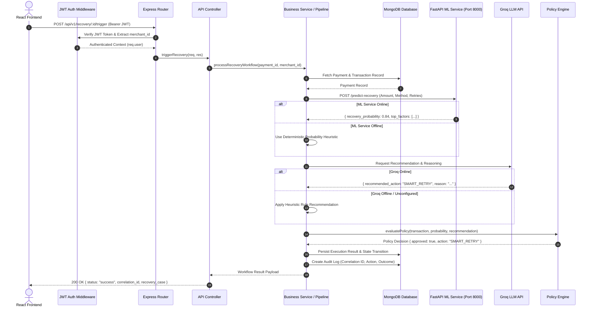

# RecoverX API Architecture & Flow Specifications

This document outlines the request execution path through the backend layers of **RecoverX**.

---

## API Layer Flow Diagram

---

## Verified Endpoints & Flow Summary

- `POST /api/v1/auth/login` $\to$ `authController.login` $\to$ Returns JWT Token & User Context
- `POST /api/v1/webhooks/razorpay` $\to$ `webhookController.handleWebhook` $\to$ HMAC Verification $\to$ Idempotency Check $\to$ MongoDB
- `GET /api/v1/transactions` $\to$ `transactionController.getTransactions` $\to$ Auth Middleware $\to$ Scoped MongoDB Query
- `POST /api/v1/recovery/:id/trigger` $\to$ `recoveryController.trigger` $\to$ Full 8-Step Pipeline
- `GET /api/v1/analytics/summary` $\to$ `analyticsController.getSummary` $\to$ Aggregated Integer Paise Metrics
- `GET /api/v1/audit-logs` $\to$ `auditController.getLogs` $\to$ Chronological Audit Logs
