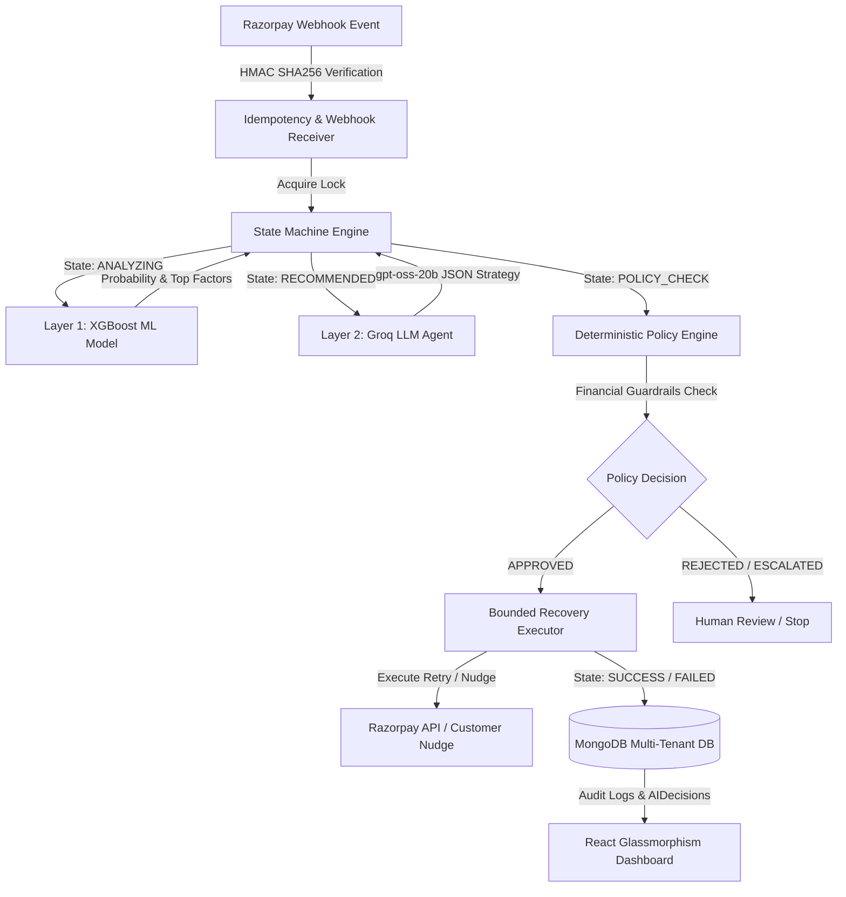

# RecoverX — Master System Architecture Document

> **Razorpay Buildathon 2026 Submission** | Track 03: AI Revenue Recovery

---

## 📌 Executive Architecture Summary

**RecoverX** is an enterprise-grade AI revenue recovery control plane designed for Razorpay merchants. It transforms payment failure handling from static retry loops into an intelligent, multi-layered decision engine backed by deterministic financial guardrails.

---

## 🏛 System Component Breakdown

---

## 🤖 Dual AI Layer Design

### Layer 1: XGBoost Recovery Predictor
* **Purpose**: Quantitative probability prediction of recovery likelihood $P(\text{recovery}) \in [0.0, 1.0]$.
* **Input Features**: `amount_paise`, `payment_method`, `failure_reason`, `previous_successes`, `previous_failures`, `retry_count`, `customer_ltv_paise`, `subscription_status`.
* **Zero Target Leakage Guarantee**: Explicitly drops all outcome/label columns (`recovered`, `amount_recovered`) from input feature space.
* **Risk Banding**:
  * `HIGH`: $P \ge 0.80$
  * `MEDIUM`: $0.50 \le P < 0.80$
  * `LOW`: $P < 0.50$

### Layer 2: Groq LLM Reasoning Agent
* **Purpose**: Context-aware qualitative strategy recommendation and customer communication generation.
* **Model**: `openai/gpt-oss-20b` hosted on Groq API (`https://api.groq.com/openai/v1`).
* **Zero OpenAI Dependency**: Communicates exclusively via Groq API provider isolation (`GroqProvider`) with zero OpenAI SDK or credentials.
* **Structured Output Schema**: Strict JSON output schema validated against permitted action enums (`SMART_RETRY`, `DELAYED_RETRY`, `PAYMENT_RECOVERY_NUDGE`, `HUMAN_ESCALATION`, `STOP`).

---

## 🛡 Deterministic Policy Engine Guardrails

Even if AI recommends an action, the **Policy Engine** evaluates strict non-bypassable financial rules:
1. `MAX_RETRIES`: Blocks retries if transaction retry count $\ge$ merchant policy limit (default 3 retries).
2. `HIGH_VALUE_TRANSACTION`: Mandatory human escalation (`HUMAN_ESCALATION`) if transaction amount $\ge$ threshold (default ₹50,000 / 5,000,000 paise).
3. `UNRECOVERABLE_FAILURE`: Forces immediate `STOP` for hard unrecoverable failure reasons (`card_expired`, `invalid_account`, `account_closed`, `fraud_suspected`).
4. `LOW_PROBABILITY_THRESHOLD`: Aborts automated retries (`STOP`) if recovery probability $P(\text{recovery}) < 0.30$.

---

## 💰 Integer Paise Money Math Specification

To eliminate floating-point rounding errors in financial transactions:
- All monetary amounts in MongoDB schemas, ML features, policy guardrails, and APIs are stored and processed as integer paise (`1 INR = 100 paise`).
- Example: ₹8,499.00 is stored as `849900` paise.
- Display formatting helper converts paise to INR on UI borders (`₹(paise / 100).toFixed(2)`).

---

## 🗄 MongoDB Multi-Tenant Database Architecture

11 Core Mongoose Schemas enforcing multi-tenant isolation via compound indexes:
1. `Merchant`: Razorpay merchant credentials and subscription tier.
2. `Customer`: Customer profile, past payment statistics, and LTV.
3. `Payment`: Failed payment details in integer paise.
4. `RecoveryCase`: State machine case lifecycle.
5. `MLPrediction`: Serialized ML model predictions and feature importance scores.
6. `AIDecision`: Groq LLM reasoning logs, prompts, and tokens used.
7. `PolicyDecision`: Evaluated guardrail rules and rejection reasons.
8. `RecoveryAction`: Executed intervention details and idempotency keys.
9. `RecoveryOutcome`: Verified recovery outcome and net recovered revenue in paise.
10. `AuditLog`: Immutable audit trail of every state transition.
11. `WebhookEvent`: Raw webhook payloads for idempotency deduplication.
