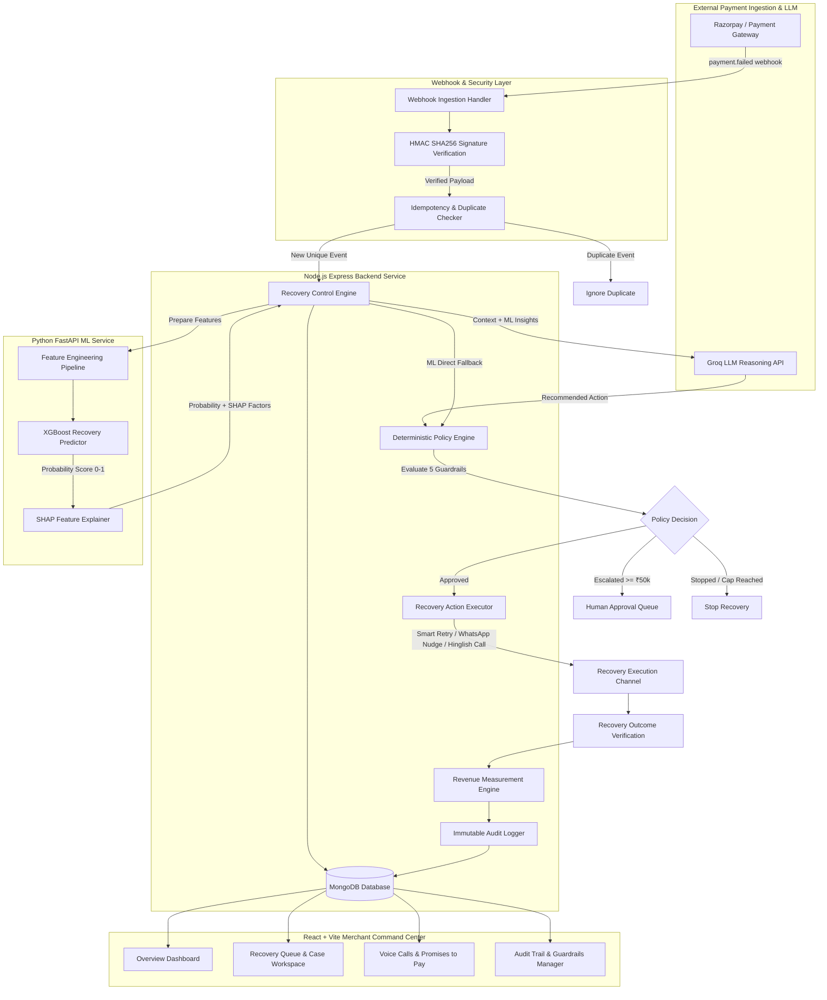
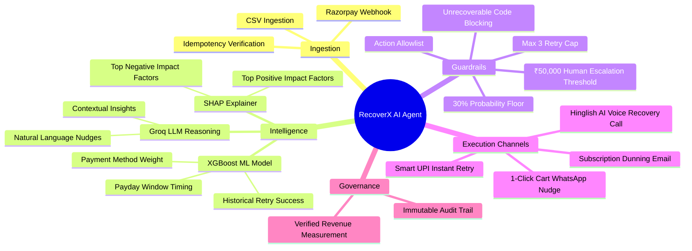

# RecoverX — System Architecture & Workflow Specifications

This document outlines the system architecture, component topology, AI decision pipeline, policy guardrails, and data flow for **RecoverX — AI Revenue Recovery Agent**.

---

## 1. System Architecture Diagram

---

## 2. Recovery Decision Mindmap

---

## 3. Core Architectural Principles

1. **XGBoost Predicts**: Quantitative ML predicts $0.0 \le p \le 1.0$ recovery probability.
2. **Groq Reasons**: LLM contextualizes historical patterns and generates personalized nudges.
3. **Policy Controls**: Deterministic policy engine enforces 5 non-bypassable guardrails.
4. **Backend Executes**: Node.js backend safely dispatches bounded recovery actions.
5. **Outcomes Measure**: Every recovered rupee is verified against initial revenue at risk.
6. **Audit Explains**: Complete state transitions and correlation IDs logged immutably.
