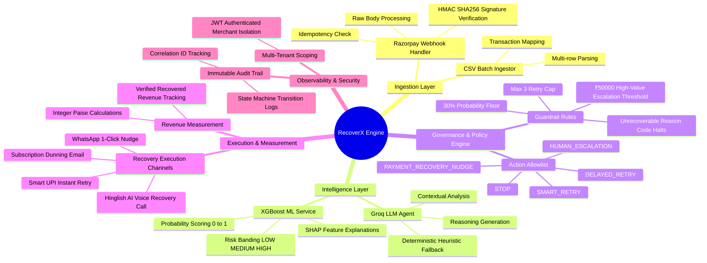

# RecoverX Complete System Mindmap

This document presents the complete component and functional mindmap for **RecoverX — AI Revenue Recovery Agent**.

```mermaid
mindmap
  root((RecoverX Engine))
    Ingestion Layer
      Razorpay Webhook Handler
        HMAC SHA256 Signature Verification
        Idempotency Check
        Raw Body Processing
      CSV Batch Ingestor
        Multi-row Parsing
        Transaction Mapping
    Intelligence Layer
      XGBoost ML Service
        Probability Scoring 0 to 1
        Risk Banding LOW MEDIUM HIGH
        SHAP Feature Explanations
      Groq LLM Agent
        Contextual Analysis
        Reasoning Generation
        Deterministic Heuristic Fallback
    Governance & Policy Engine
      Action Allowlist
        SMART_RETRY
        DELAYED_RETRY
        PAYMENT_RECOVERY_NUDGE
        HUMAN_ESCALATION
        STOP
      Guardrail Rules
        Max 3 Retry Cap
        30% Probability Floor
        ₹50000 High-Value Escalation Threshold
        Unrecoverable Reason Code Halts
    Execution & Measurement
      Recovery Execution Channels
        Smart UPI Instant Retry
        WhatsApp 1-Click Nudge
        Subscription Dunning Email
        Hinglish AI Voice Recovery Call
      Revenue Measurement
        Integer Paise Calculations
        Verified Recovered Revenue Tracking
    Observability & Security
      Immutable Audit Trail
        Correlation ID Tracking
        State Machine Transition Logs
      Multi-Tenant Scoping
        JWT Authenticated Merchant Isolation
```
