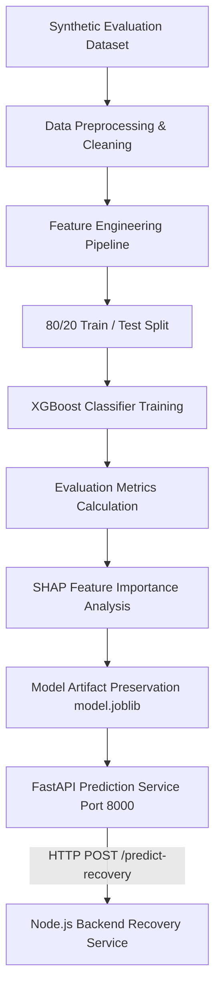

# RecoverX ML Service Architecture & Pipeline

This document specifies the Machine Learning architecture, feature engineering, model training, evaluation, and inference pipeline for **RecoverX**.

---

## 1. Machine Learning Pipeline Flow

---

## 2. Feature Matrix & Target Definition

### Input Features
- `amount_paise` / `amount_inr`: Transaction amount
- `payment_method`: `upi`, `card`, `netbanking`, `wallet`
- `failure_reason`: `insufficient_balance`, `bank_timeout`, `network_error`, `card_expired`
- `previous_successes`: Integer count of successful past payments
- `previous_failures`: Integer count of past failed payments
- `retry_count`: Current transaction retry attempt count
- `customer_ltv_inr`: Customer Lifetime Value in INR
- `subscription_status`: `active`, `pending`, `none`, `halted`

### Target Variable
- `recovery_success`: Binary indicator ($1 =$ Recovered, $0 =$ Unrecovered)

### Leakage Prevention Audit
Post-retry outcome fields (`recovered`, `amount_recovered`, `post_retry_status`) are strictly excluded from prediction input features to guarantee zero data leakage.
