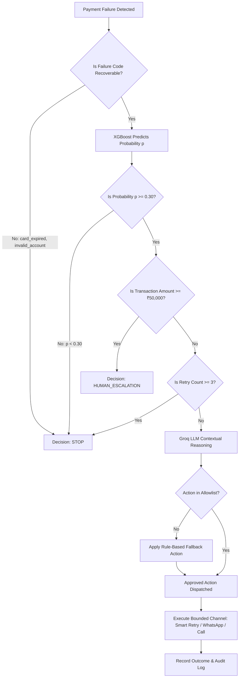

# RecoverX Recovery Decision Flow & Guardrails

This document outlines the step-by-step decision tree enforced by **RecoverX** when processing a failed transaction.

---

## Recovery Decision Flowchart

