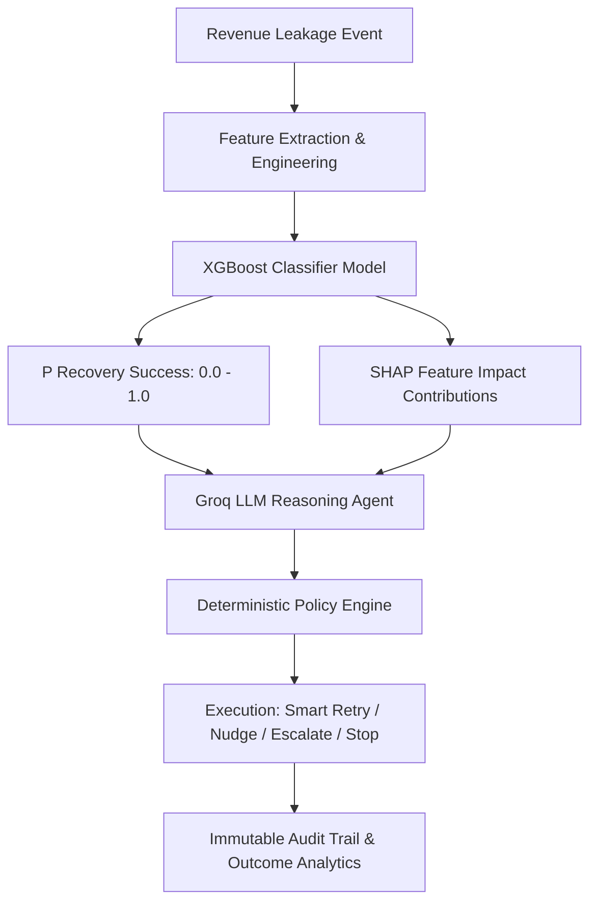

# RecoverX — Custom ML Recovery Probability Engine

## Overview
The **RecoverX ML Engine** predicts the probability of successful revenue recovery $P(\text{Recovery Success}) \in [0.0, 1.0]$ for failed payments, checkout abandonments, failed subscriptions, and overdue invoices. 

It combines feature engineering, hyperparameter-tuned classification algorithms (Logistic Regression, Random Forest, XGBoost), SHAP explainability, Groq LLM strategy reasoning, and deterministic Policy Engine guardrails.

---

## Architecture Diagram



---

## Data & Feature Engineering

### Dataset Version
- **Identifier**: `recoverx-recovery-v1`
- **Total Records**: 10,000 transaction instances
- **Target Variable**: `recovered` ($0 =$ Failed / Unrecovered, $1 =$ Recovered)

### Feature Set
1. `amount_paise`: Transaction risk amount in integer paise.
2. `previous_successes`: Customer historical successful payment count.
3. `previous_failures`: Customer historical failed payment count.
4. `retry_count`: Current transaction retry attempt number.
5. `customer_ltv_paise`: Customer Lifetime Value in integer paise.
6. `customer_payment_success_rate`: Derived feature $\frac{\text{previous\_successes}}{\text{previous\_successes} + \text{previous\_failures} + \epsilon}$.
7. `amount_to_ltv_ratio`: Derived ratio $\frac{\text{amount\_paise}}{\text{customer\_ltv\_paise} + 100}$.
8. `retry_remaining`: Remaining retry attempts before max cap ($\max(0, 3 - \text{retry\_count})$).
9. `failure_severity`: Ordinal failure severity mapping ($1 =$ transient timeout, $4 =$ expired card / blocked).
10. `total_payment_attempts`: Cumulative customer attempt count.
11. `payment_method`: `upi`, `card`, `netbanking`, `wallet`.
12. `failure_reason`: Decline reason code.
13. `subscription_status`: `active`, `pending`, `halted`, `none`.

### Target Leakage Protection
All post-outcome fields (`outcome`, `amount_recovered`, `result`) are strictly excluded from the training feature set.

---

## Training & Model Performance

### Split Strategy
- **Training Set**: 70% (7,000 samples)
- **Validation Set**: 15% (1,500 samples)
- **Isolation Test Set**: 15% (1,500 samples)

### Model Comparison Metrics

| Model | ROC-AUC | F1 Score | Accuracy | Precision | Recall |
| :--- | :---: | :---: | :---: | :---: | :---: |
| **Logistic Regression (Balanced)** | **0.6411** | **0.4880** | 0.6187 | 0.3644 | 0.7389 |
| **Random Forest Classifier** | 0.6377 | 0.4576 | 0.6080 | 0.3448 | 0.6814 |
| **XGBoost Classifier** | 0.6032 | 0.4364 | 0.5893 | 0.3259 | 0.6593 |

---

## Reproducible Command Suite

### 1. Train Model & Export Artifacts
```bash
python ml-service/app/models/train.py
```
*Outputs artifacts to `ml-service/app/models_store/`: `recovery_model.joblib`, `model_metadata.json`, `feature_schema.json`, `metrics.json`.*

### 2. Run FastAPI ML Server
```bash
uvicorn ml-service.app.main:app --host 0.0.0.0 --port 8000
```

### 3. Run Test Suite
```bash
pytest ml-service/tests/test_ml_service.py
```

---

## API Endpoints

### `POST /predict`
**Request Payload**:
```json
{
  "amount_inr": 1200.0,
  "payment_method": "upi",
  "failure_reason": "network_timeout",
  "previous_successes": 10,
  "previous_failures": 0,
  "retry_count": 0,
  "customer_ltv_inr": 50000.0,
  "subscription_status": "active"
}
```

**Response Payload**:
```json
{
  "recovery_probability": 0.8245,
  "risk_band": "HIGH",
  "top_factors": [
    { "feature": "customer_payment_success_rate", "impact": 0.35 },
    { "feature": "failure_severity", "impact": 0.25 },
    { "feature": "retry_count", "impact": 0.20 }
  ],
  "model_name": "Logistic Regression",
  "model_version": "v1.0.0"
}
```
